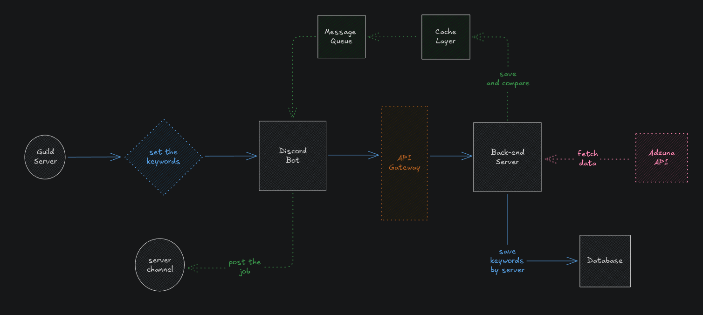

# Discover

Discover is a Discord bot that helps communities stay up-to-date with fresh job opportunities every day.
Guilds can set their own keywords (like “frontend”, “junior”, or “remote”) and receive daily curated job postings right in their channels.

Built with ElysiaJS, Redis, RabbitMQ, and PostgreSQL, it combines a modern backend architecture with queue-based processing for reliability and scalability.

## ⚙️ Features

- Slash commands to manage job keywords and posting channels

- Daily automated job fetching via external APIs

- Redis cache and message queue for smooth async operations

- Simple rate limits and cooldowns per guild

Designed to be fast, modular, and production-ready.

## 📐 Architecture

